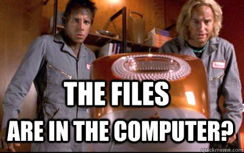

 
Hi! I'm Cate. This is me on the left:  
 
 

###TL;DR###
I'm a PhD Candidate in clinical and quantitative psychology at the University of Miami. My research interests involve applying data science and machine learning methods to improve our ability to classify and predict individuals at risk for anxiety and obsessive-compulsive spectrum disorders. 
  

###Can *you* show me how to make a wesbite?###
I've been working as a researcher for about 7 years now in various lab settings, and I have been fortunate to receive extensive training in advanced biostatistics and quantitative psychology methods. However, my background as an undergraduate at Columbia University was in comparative literature and psychology, so I encountered some obstacles to get to this point in my data science journey. Here are some snapshots: 
 
 
1. Confronting the Stack Exchange bullies:  

  

 
2. Trying to use Github:  

  

 
Somehow, despite these challenges, I've made it through -- and I even got this Rpub to make Internets! 

In all seriousness, I love what I study, and I am insanely excited about the data science tools I have discovered to improve upon and showcase my research. More generally, I'm passionate about moving research in clinical psychology to a place of greater transparency, a goal we can achieve only if we begin to share our data, methods, and mistakes with the world. Consequently, I'm taking the plunge from the windowless PhD student office I've inhabited for the past four years, to the brutal world of public projects. If anything, I've heard exposure is good for treating anxiety -- but hey, I'm no psychologist. 
