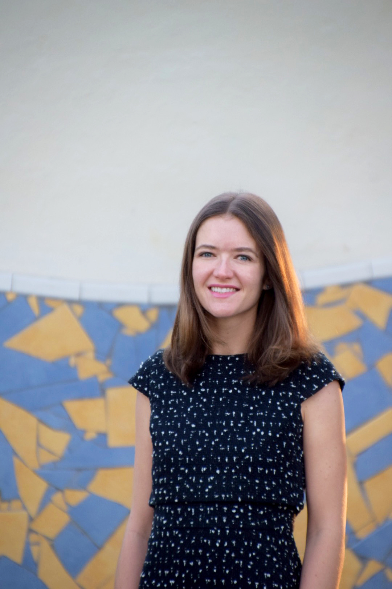

 

###About Me###

I am a clinical research psychologist with a background in biostatistics, data science, and psychometrics. At the crux of my research lies the question of what factors exacerbate and maintain psychiatric symptoms. In particular, I aim to understand how cognitive factors (e.g., decision-making; attention; language) interact with emotional vulnerabilities to engender risk for anxiety, OC-spectrum, and related disorders.

To answer these questions, I focus on three primary research goals. First, I rely on multimethod experiments that draw not only from experimental psychology, but also from fields as diverse as behavioral economics, neuroscience, physiology, and genetics. Second, I consider issues of psychometrics and measurement, along with broader cultural considerations that may impact whether we are measuring the constructs we care about in a valid way. Third, I aim to capitalize on methods from data science and machine learning to improve our models of prediction, which has allowed me to gain competencies in R, SPSS, Mplus, MATLAB, Python, and additional programs, along with advanced statistical modeling techniques.

As I complete my PhD in Clinical Psychology, specializing in Quantitative Psychology, I am seeking a career conducting quantitative research on cognitive and emotional risk and maintenance factors for anxiety, OC-spectrum, and related disorders.
  

###Education###
**Ph.D.,** Clinical Psychology, Quantitative Psychology Specialization, Expected May 2021 
**University of Miami,** Coral Gables, FL

**M.S.,** Research in Clinical Health Psychology, July 2015 
**Autonomous University of Barcelona,** Spain

**B.A.,** Psychology | Comparative Literature & Society, May 2013 
**Columbia University,** New York, NY 
<i><b>Summa cum laude</b></i> 
<i><b>Phi Beta Kappa</b></i>, early induction
